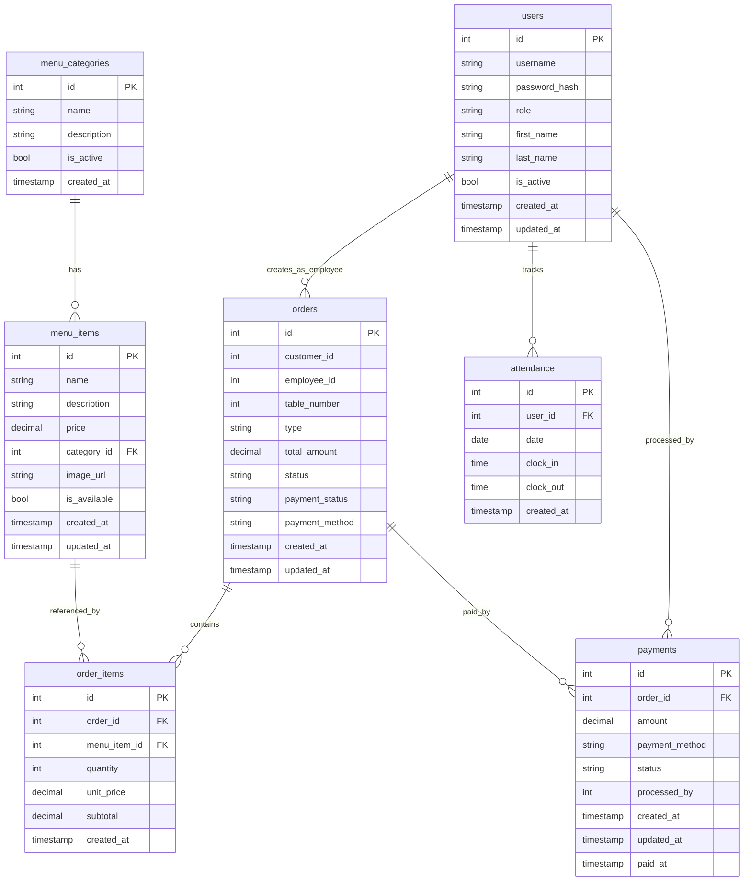
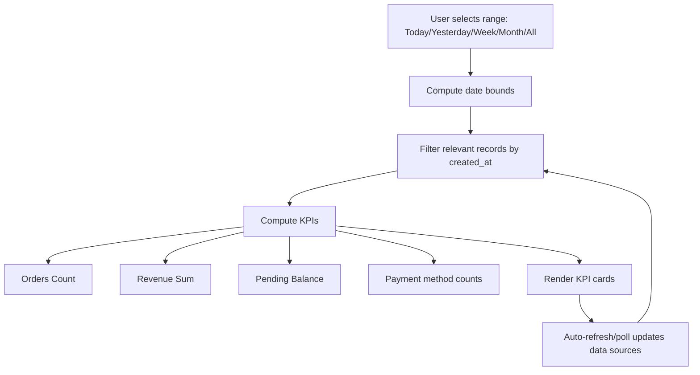

# App Flowcharts (Detailed)

This document contains detailed Mermaid flowcharts for the application.

## How to use this document

### Rendering the diagrams

- **GitHub**: Mermaid usually renders automatically in Markdown fenced blocks.
- **VS Code**: Install a Mermaid preview extension, then preview this file.
- **Mermaid Live**: Copy/paste a diagram block into https://mermaid.live to export PNG/SVG.

### Conventions used

- **Rectangles** represent pages/screens or actions.
- **Diamond nodes** represent decisions.
- **Edge labels** like `GET` / `POST` indicate the HTTP method.
- **API paths** are written as they appear in routes (prefix your server base path, e.g. `/api`).

### Guidance on keeping diagrams accurate

- If you change an endpoint path, also update it here.
- If you add a new role/page, add it to section (1) and expand the relevant flow.

## 1) High-Level Role-Based User Flows

**Purpose**

This chart shows how authentication routes users into role-specific areas of the app.

**Key notes**

- This is the entry point for all roles.
- If login succeeds but user lands on the wrong page, the issue is usually in the **role → redirect mapping** on the frontend.

```mermaid
flowchart TD
  A[Open App] --> B[Login]

  B -->|Traditional (username/password)| C1[POST /api/auth/login]
  B -->|Staff Login (name/password)| C2[POST /api/auth/staff-login]
  B -->|PIN Login (name + 4-digit pin)| C3[POST /api/auth/pin-login]

  C1 --> D{Auth Success?}
  C2 --> D
  C3 --> D

  D -->|No| E[Show error]
  D -->|Yes| F{Role}

  F -->|Admin| G[Admin Dashboard]
  F -->|Cashier| H[Cashier Dashboard]
  F -->|Cafe Waiter| I[Waiter: Create Order]
  F -->|Bakery Employee| J[Bakery: Create Order]
  F -->|Kitchen Staff| K[Kitchen Orders Screen]
```

## 2) Waiter (Cafe) End-to-End Flow

**Purpose**

Shows the full lifecycle of a cafe order from creation to payment.

**Key notes**

- “Orders Ready for Payment” depends on the order reaching a ready/completed state.
- If the cashier cannot see an order, check status transitions and the pending-payment endpoint.

```mermaid
flowchart TD
  W0[Waiter Login] --> W1[Create Order Page]

  W1 --> W2[Select Table or Take Away]
  W2 --> W3[Browse Menu + Search]
  W3 --> W4[Add Items to Cart]
  W4 --> W5[Submit Order]

  W5 -->|POST| W6[/api/orders/cafe]
  W6 --> W7{Order Created?}
  W7 -->|No| W8[Show error / retry]
  W7 -->|Yes| W9[Order status: pending]

  W9 --> W10[Kitchen prepares order]
  W10 --> W11[Kitchen marks ready]
  W11 -->|PATCH| W12[/api/orders/:id/ready or /food-ready]

  W12 --> W13[Order status: ready]
  W13 --> W14[Cashier sees in Orders Ready for Payment]
  W14 --> W15[Cashier processes payment]
  W15 --> W16[Payment + confirmation]
  W16 --> W17[Order becomes paid]
```

## 3) Kitchen Flow

**Purpose**

Shows how the kitchen views orders and marks them ready.

**Key notes**

- If the kitchen page is empty, verify the kitchen orders endpoint and filters used.
- If orders never become “ready”, verify the PATCH endpoint and database update.

```mermaid
flowchart TD
  K0[Kitchen Staff Login] --> K1[Kitchen Orders]

  K1 --> K2[Fetch active orders]
  K2 -->|GET| K3[/api/orders/kitchen/orders]

  K3 --> K4[View order items]
  K4 --> K5[Prepare items]
  K5 --> K6[Mark food ready]
  K6 -->|PATCH| K7[/api/orders/:id/food-ready]

  K7 --> K8[Order now ready]
  K8 --> K9[Cashier can process payment]
```

## 4) Cashier Payment Processing Flow (Cash + QR)

**Purpose**

Shows how cash and QR payments are created and confirmed, and how dashboards refresh.

**Key notes**

- After confirmation, the system should update the order to **paid** (status/payment status) and remove it from pending lists.
- If KPIs don’t update, verify the refresh/polling cycle and that the backend updates the correct order fields.

```mermaid
flowchart TD
  C0[Cashier Login] --> C1[Cashier Dashboard]

  C1 --> C2[Auto-refresh pending payment orders]
  C2 -->|GET| C3[/api/orders/payment/pending]

  C1 --> C4[Select order ready for payment]
  C4 --> C5{Payment method}

  C5 -->|Cash| C6[Create payment record]
  C6 -->|POST| C7[/api/payments]
  C7 --> C8[Confirm payment]
  C8 -->|POST/PUT| C9[/api/payments/:id/confirm]
  C9 --> C10[Order status/payment_status set to paid]

  C5 -->|QR Code| Q1[Create QR payment]
  Q1 -->|POST| Q2[/api/payments/qr]
  Q2 --> Q3[Show QR to customer]
  Q3 --> Q4[Customer pays externally]
  Q4 --> Q5[Confirm payment when received]
  Q5 -->|POST/PUT| Q6[/api/payments/:id/confirm]
  Q6 --> C10

  C10 --> C11[Refresh dashboard KPIs + lists]
  C11 -->|GET| C12[/api/payments (recent/all)]
  C11 -->|GET| C13[/api/orders/payment/pending]
```

## 5) Employees (Waiters) Operations Flow (Cashier → Employees)

**Purpose**

Explains how a cashier can drill into a specific waiter/employee to view their performance and pending-payment orders.

**Key notes**

- The employee selector drives the `employee_id` filter.
- “Orders Ready for Payment” should be **newest-first** (sort by `created_at`/`updated_at`, fallback to `id`).
- If item details are missing, verify the pending-payment endpoint returns `items`, or the UI fetches order details by id.

```mermaid
flowchart TD
  E0[Cashier Dashboard] --> E1[Employees Navigation]
  E1 --> E2[Select Employee]

  E2 --> E3[Load employee orders]
  E3 -->|GET| E4[/api/orders?type=cafe&employee_id=...]

  E2 --> E5[Load orders ready for payment (employee-specific)]
  E5 -->|GET| E6[/api/orders/payment/pending?employee_id=...]

  E6 --> E7[Show Orders Ready for Payment]
  E7 --> E8[Process payment]
  E8 -->|POST| E9[/api/payments]
  E9 -->|confirm| E10[/api/payments/:id/confirm]
  E10 --> E11[Refresh employee KPIs + lists]
```

## 6) Attendance Flow (Cashier Clock In/Out)

**Purpose**

Shows the attendance state machine for a cashier.

**Key notes**

- If clock-in/out buttons do nothing, verify the attendance endpoints and auth middleware.
- If times look wrong, confirm server timezone vs client timezone.

```mermaid
flowchart TD
  A0[Cashier Dashboard] --> A1{Attendance status}
  A1 -->|Not clocked in| A2[Clock In]
  A2 -->|POST| A3[/api/attendance/clock-in]
  A3 --> A4[Show clock-in time]

  A1 -->|Clocked in| A5[Clock Out]
  A5 -->|POST| A6[/api/attendance/clock-out]
  A6 --> A7[Clear attendance status]
```

## 7) Printing Flow (QZ Tray + Server Polling)

**Purpose**

Explains how the server discovers unprinted orders and sends them to QZ Tray / the printer.

**Key notes**

- The system typically uses **polling** (repeated GET) rather than push.
- For slow networks, prefer longer timeouts + retry/backoff.
- If printing works locally but fails in deployment, verify QZ Tray connectivity and printer configuration.

```mermaid
flowchart TD
  P0[Server] --> P1[Poll for unprinted orders]
  P1 -->|GET| P2[/api/orders/unprinted]

  P2 --> P3{Any unprinted?}
  P3 -->|No| P1
  P3 -->|Yes| P4[Build receipt text]
  P4 --> P5[Send to QZ Tray / printer]

  P5 --> P6{Print success?}
  P6 -->|No| P7[Retry with backoff / log error]
  P6 -->|Yes| P8[Mark printed]
  P8 -->|PATCH/POST| P9[/api/orders/:id/printed]
  P9 --> P1
```

## 8) System Architecture (Detailed)

**Purpose**

Gives a mental model of the app’s components and how requests flow.

**Key notes**

- The React frontend calls Express JSON endpoints.
- Controllers coordinate validation and business rules.
- Models perform SQL queries against PostgreSQL.
- Printing is handled through helpers that integrate with QZ Tray.

```mermaid
flowchart LR
  subgraph Client[Client Devices]
    R1[React Frontend
(Cashier/Admin/Waiter/Kitchen)]
  end

  subgraph Server[Node.js / Express Backend]
    S1[Express API Routes]
    S2[Controllers]
    S3[Models]
    S4[Auth Middleware]
    S5[QZ/Printing Helpers]
  end

  subgraph DB[PostgreSQL]
    D1[(users)]
    D2[(orders)]
    D3[(order_items)]
    D4[(payments)]
    D5[(attendance)]
    D6[(menu_items)]
    D7[(menu_categories)]
  end

  subgraph Printer[Printing]
    QZ[QZ Tray]
    PRN[Receipt Printer]
  end

  R1 -->|HTTPS/JSON| S1
  S1 --> S2
  S2 --> S3
  S2 --> S4
  S3 --> DB

  S5 --> QZ --> PRN
  S1 --> S5
```

## 9) Database ERD (Core Tables)

**Purpose**

Shows core entities and relationships. Use this when adding new features or debugging data bugs.

**Key notes**

- `orders` is the parent record. `order_items` holds item lines.
- `payments` references `orders` and is processed by a user.
- If KPIs are wrong, verify which field is authoritative (e.g., `orders.payment_status` vs `orders.status`).



## 10) KPI/Stats Time-Range Filter Logic (Conceptual)

**Purpose**

Explains how KPI cards should be computed when the range changes.

**Key notes**

- A range selector changes date bounds.
- Records are filtered by timestamp fields (usually `created_at`).
- KPIs should recompute when the underlying dataset changes (polling/refresh).


