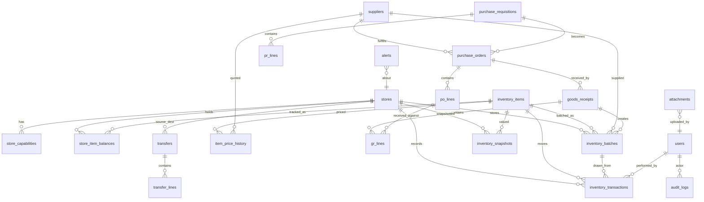

# Green Bush Garden — Inventory System
# Phase 0 (Migration Foundation) + Phase 1 (Ledger Spine + Concurrency + Batches)

**Status:** Design frozen. Implement Phase 0 & Phase 1 only. Schema is created up front (all tables, so FKs/migrations are stable); application behavior is built incrementally — Phase 2+ tables exist but their write endpoints are deferred.

**Approved architectural decisions**
- PostgreSQL deployment: **single centralized server on the LAN**; every restaurant PC connects to it. No per-PC database.
- Migration scope: **inventory domain only**. Attendance, payroll, payments stay on their current path.
- Timezone: **Africa/Addis_Ababa (UTC+3)** for snapshots, daily boundaries, reporting.
- Backups: **local + offsite/cloud copy** (Google Drive / OneDrive / S3).
- Migration framework: **node-pg-migrate**.

**Global conventions used throughout**
- All timestamps are `TIMESTAMPTZ`, default `now()`. Day boundaries computed in `Africa/Addis_Ababa`.
- Quantities `NUMERIC(14,3)`; unit costs / weighted-average cost `NUMERIC(14,4)`; money values `NUMERIC(16,2)`.
- Surrogate PKs: `BIGINT GENERATED ALWAYS AS IDENTITY`. The existing `users.id` is `SERIAL` (INTEGER), so all `*_by`/`user` FKs are `INTEGER`.
- `created_at` on every table; `updated_at` only on mutable tables, maintained by a trigger.
- **Master data** (stores, items, suppliers) uses **soft delete** (`deleted_at`). **Ledger/audit/snapshots are immutable** (insert-only, mutation blocked by trigger).
- Response envelope (matches existing API): `{ status: 'success'|'error', data: {...}, message?: string, code?: string }`.

---

## Table of contents
1. PostgreSQL DDL
2. Weighted Average Cost (WAC) design
3. Store capability system
4. Attachment architecture
5. Transaction & concurrency specification
6. JSON → PostgreSQL migration strategy
7. REST API contract (Phase 0 + Phase 1)
8. Index & performance plan
9. Security & anti-theft enforcement
10. Final deliverables: ERD, migration order, roadmap, dependency graph, module boundaries, testing & concurrency plan, backup/recovery

---

## 1. Full PostgreSQL DDL

> Delivered as ordered `node-pg-migrate` migrations. Migration **000** creates enums + shared trigger functions; subsequent migrations create tables in FK-dependency order (see §10). SQL below is the consolidated target schema.

### 1.0 Enums & shared functions

```sql
-- ---------- ENUM types (stable domains) ----------
CREATE TYPE transaction_type AS ENUM (
  'opening_balance','purchase_receipt','transfer_out','transfer_in',
  'consumption','sale','waste','adjustment','stock_count'
);

CREATE TYPE pr_status AS ENUM (
  'draft','pending_fnb','pending_owner','approved','partially_approved',
  'rejected','closed','cancelled'
);

CREATE TYPE po_status AS ENUM (
  'draft','issued','partially_received','received','closed','cancelled'
);

CREATE TYPE transfer_status AS ENUM (
  'pending_fnb','approved','partially_approved','rejected',
  'sent','received','closed','cancelled'
);

CREATE TYPE gr_status AS ENUM ('draft','posted','cancelled');

CREATE TYPE alert_severity AS ENUM ('info','warning','critical');
CREATE TYPE alert_status   AS ENUM ('open','acknowledged','resolved','dismissed');

CREATE TYPE attachment_entity AS ENUM (
  'purchase_requisition','purchase_order','goods_receipt','transfer',
  'stock_count','waste','audit','invoice','other'
);

-- alert_type is intentionally VARCHAR (not enum): the alert engine and fraud
-- detection add categories over time without a schema migration.

-- ---------- shared trigger functions ----------
CREATE OR REPLACE FUNCTION set_updated_at() RETURNS trigger AS $$
BEGIN NEW.updated_at = now(); RETURN NEW; END;
$$ LANGUAGE plpgsql;

-- Append-only guard for immutable tables (ledger, audit, snapshots).
CREATE OR REPLACE FUNCTION prevent_mutation() RETURNS trigger AS $$
BEGIN
  RAISE EXCEPTION 'Table % is append-only; % is not permitted',
    TG_TABLE_NAME, TG_OP USING ERRCODE = '0A000';
END;
$$ LANGUAGE plpgsql;

-- Per-document number sequences (txn/pr/po/gr/transfer numbers).
CREATE SEQUENCE seq_inventory_txn;
CREATE SEQUENCE seq_pr;
CREATE SEQUENCE seq_po;
CREATE SEQUENCE seq_gr;
CREATE SEQUENCE seq_transfer;
```

### 1.1 stores

```sql
CREATE TABLE stores (
  id          BIGINT GENERATED ALWAYS AS IDENTITY PRIMARY KEY,
  code        VARCHAR(40)  NOT NULL UNIQUE,          -- e.g. 'main_store'
  name        VARCHAR(120) NOT NULL,
  description TEXT,
  icon        VARCHAR(16),
  manager_id  INTEGER REFERENCES users(id) ON DELETE SET NULL,
  is_active   BOOLEAN NOT NULL DEFAULT true,
  deleted_at  TIMESTAMPTZ,
  created_at  TIMESTAMPTZ NOT NULL DEFAULT now(),
  updated_at  TIMESTAMPTZ NOT NULL DEFAULT now()
);
CREATE TRIGGER trg_stores_updated BEFORE UPDATE ON stores
  FOR EACH ROW EXECUTE FUNCTION set_updated_at();
CREATE INDEX idx_stores_active ON stores(is_active) WHERE deleted_at IS NULL;
```

### 1.2 store_capabilities

```sql
-- Configurable per-store capabilities. Adding a new capability or a new store
-- is data-only (no code change). App checks has_capability(store, key).
CREATE TABLE store_capabilities (
  id              BIGINT GENERATED ALWAYS AS IDENTITY PRIMARY KEY,
  store_id        BIGINT NOT NULL REFERENCES stores(id) ON DELETE CASCADE,
  capability_key  VARCHAR(60) NOT NULL,   -- e.g. 'can_purchase_directly'
  enabled         BOOLEAN NOT NULL DEFAULT true,
  config          JSONB,                  -- optional per-capability params
  created_at      TIMESTAMPTZ NOT NULL DEFAULT now(),
  updated_at      TIMESTAMPTZ NOT NULL DEFAULT now(),
  UNIQUE (store_id, capability_key)
);
CREATE TRIGGER trg_store_caps_updated BEFORE UPDATE ON store_capabilities
  FOR EACH ROW EXECUTE FUNCTION set_updated_at();
CREATE INDEX idx_store_caps_store ON store_capabilities(store_id);
```

### 1.3 users (ALTER — table already exists)

```sql
-- Widen roles and add store scoping. (users.id stays SERIAL/INTEGER.)
ALTER TABLE users DROP CONSTRAINT IF EXISTS users_role_check;
ALTER TABLE users ADD CONSTRAINT users_role_check CHECK (role IN (
  'admin','owner','fnb_manager','store_admin','purchaser',
  'cashier','kitchen_staff','cafe_waiter','bakery_employee','hr_admin','item_request'
));
ALTER TABLE users ADD COLUMN IF NOT EXISTS store_id BIGINT REFERENCES stores(id) ON DELETE SET NULL;
CREATE INDEX IF NOT EXISTS idx_users_store ON users(store_id);
```

### 1.4 inventory_items (product master — global, not per store)

```sql
CREATE TABLE inventory_items (
  id                BIGINT GENERATED ALWAYS AS IDENTITY PRIMARY KEY,
  item_code         VARCHAR(40)  NOT NULL UNIQUE,
  description       VARCHAR(200) NOT NULL,
  category          VARCHAR(60),
  uom               VARCHAR(20)  NOT NULL DEFAULT 'pcs',
  is_perishable     BOOLEAN NOT NULL DEFAULT false,
  track_batches     BOOLEAN NOT NULL DEFAULT false,  -- forces batch on receipt
  default_min_qty   NUMERIC(14,3) NOT NULL DEFAULT 0 CHECK (default_min_qty >= 0),
  default_reorder   NUMERIC(14,3) NOT NULL DEFAULT 0 CHECK (default_reorder  >= 0),
  is_active         BOOLEAN NOT NULL DEFAULT true,
  deleted_at        TIMESTAMPTZ,
  created_at        TIMESTAMPTZ NOT NULL DEFAULT now(),
  updated_at        TIMESTAMPTZ NOT NULL DEFAULT now()
);
CREATE TRIGGER trg_items_updated BEFORE UPDATE ON inventory_items
  FOR EACH ROW EXECUTE FUNCTION set_updated_at();
CREATE INDEX idx_items_active   ON inventory_items(is_active) WHERE deleted_at IS NULL;
CREATE INDEX idx_items_category ON inventory_items(category);
```

### 1.5 store_item_balances (materialized per-store balance — the lockable truth)

```sql
CREATE TABLE store_item_balances (
  id                BIGINT GENERATED ALWAYS AS IDENTITY PRIMARY KEY,
  store_id          BIGINT NOT NULL REFERENCES stores(id)          ON DELETE RESTRICT,
  item_id           BIGINT NOT NULL REFERENCES inventory_items(id) ON DELETE RESTRICT,
  quantity          NUMERIC(14,3) NOT NULL DEFAULT 0 CHECK (quantity >= 0), -- backstop: stock never negative
  weighted_avg_cost NUMERIC(14,4) NOT NULL DEFAULT 0 CHECK (weighted_avg_cost >= 0),
  min_quantity      NUMERIC(14,3) NOT NULL DEFAULT 0,
  reorder_point     NUMERIC(14,3) NOT NULL DEFAULT 0,
  last_movement_at  TIMESTAMPTZ,
  created_at        TIMESTAMPTZ NOT NULL DEFAULT now(),
  updated_at        TIMESTAMPTZ NOT NULL DEFAULT now(),
  UNIQUE (store_id, item_id)
);
CREATE TRIGGER trg_balances_updated BEFORE UPDATE ON store_item_balances
  FOR EACH ROW EXECUTE FUNCTION set_updated_at();
CREATE INDEX idx_balances_store    ON store_item_balances(store_id);
CREATE INDEX idx_balances_low      ON store_item_balances(store_id) WHERE quantity <= min_quantity;
```

### 1.6 inventory_batches (batch / expiry tracking, FEFO)

```sql
CREATE TABLE inventory_batches (
  id            BIGINT GENERATED ALWAYS AS IDENTITY PRIMARY KEY,
  store_id      BIGINT NOT NULL REFERENCES stores(id)          ON DELETE RESTRICT,
  item_id       BIGINT NOT NULL REFERENCES inventory_items(id) ON DELETE RESTRICT,
  supplier_id   BIGINT REFERENCES suppliers(id)                ON DELETE SET NULL,
  gr_id         BIGINT,  -- FK added after goods_receipts exists (see migration order)
  batch_number  VARCHAR(60),
  mfg_date      DATE,
  expiry_date   DATE,
  qty_received  NUMERIC(14,3) NOT NULL CHECK (qty_received > 0),
  qty_remaining NUMERIC(14,3) NOT NULL CHECK (qty_remaining >= 0),
  unit_cost     NUMERIC(14,4) NOT NULL DEFAULT 0,
  received_at   TIMESTAMPTZ NOT NULL DEFAULT now(),
  created_at    TIMESTAMPTZ NOT NULL DEFAULT now(),
  updated_at    TIMESTAMPTZ NOT NULL DEFAULT now(),
  CHECK (qty_remaining <= qty_received),
  UNIQUE (store_id, item_id, batch_number)
);
CREATE TRIGGER trg_batches_updated BEFORE UPDATE ON inventory_batches
  FOR EACH ROW EXECUTE FUNCTION set_updated_at();
-- FEFO consumption: earliest non-empty expiry first.
CREATE INDEX idx_batches_fefo   ON inventory_batches(store_id, item_id, expiry_date)
  WHERE qty_remaining > 0;
CREATE INDEX idx_batches_expiry ON inventory_batches(expiry_date) WHERE qty_remaining > 0;
```

### 1.7 inventory_transactions (the immutable ledger — spine)

```sql
CREATE TABLE inventory_transactions (
  id                    BIGINT GENERATED ALWAYS AS IDENTITY PRIMARY KEY,
  txn_number            VARCHAR(30) NOT NULL UNIQUE,
  txn_type              transaction_type NOT NULL,
  store_id              BIGINT NOT NULL REFERENCES stores(id)          ON DELETE RESTRICT,
  item_id               BIGINT NOT NULL REFERENCES inventory_items(id) ON DELETE RESTRICT,
  batch_id              BIGINT REFERENCES inventory_batches(id)        ON DELETE RESTRICT,
  quantity              NUMERIC(14,3) NOT NULL CHECK (quantity <> 0),  -- signed (+in / -out)
  uom                   VARCHAR(20) NOT NULL,
  unit_cost             NUMERIC(14,4) NOT NULL DEFAULT 0,
  total_cost            NUMERIC(16,4) NOT NULL DEFAULT 0,              -- signed quantity*unit_cost
  balance_after         NUMERIC(14,3) NOT NULL CHECK (balance_after >= 0),
  wac_after             NUMERIC(14,4) NOT NULL DEFAULT 0,
  reference_type        VARCHAR(40),   -- 'goods_receipt'|'transfer'|'order'|'waste'|'stock_count'|'adjustment'|'opening'
  reference_id          BIGINT,
  counterparty_store_id BIGINT REFERENCES stores(id) ON DELETE RESTRICT, -- for transfers
  idempotency_key       VARCHAR(80) UNIQUE,
  note                  TEXT,
  created_by            INTEGER NOT NULL REFERENCES users(id) ON DELETE RESTRICT,
  created_by_role       VARCHAR(30),
  created_at            TIMESTAMPTZ NOT NULL DEFAULT now()
  -- no updated_at, no deleted_at: append-only
);
CREATE TRIGGER trg_txn_immutable BEFORE UPDATE OR DELETE ON inventory_transactions
  FOR EACH ROW EXECUTE FUNCTION prevent_mutation();
CREATE INDEX idx_txn_store_item_time ON inventory_transactions(store_id, item_id, created_at DESC);
CREATE INDEX idx_txn_type            ON inventory_transactions(txn_type);
CREATE INDEX idx_txn_reference       ON inventory_transactions(reference_type, reference_id);
CREATE INDEX idx_txn_batch           ON inventory_transactions(batch_id);
CREATE INDEX idx_txn_time            ON inventory_transactions(created_at DESC);
```

### 1.8 suppliers

```sql
CREATE TABLE suppliers (
  id             BIGINT GENERATED ALWAYS AS IDENTITY PRIMARY KEY,
  name           VARCHAR(160) NOT NULL,
  contact_person VARCHAR(120),
  phone          VARCHAR(40),
  email          VARCHAR(120),
  address        TEXT,
  tax_number     VARCHAR(60),
  notes          TEXT,
  is_active      BOOLEAN NOT NULL DEFAULT true,
  deleted_at     TIMESTAMPTZ,
  created_at     TIMESTAMPTZ NOT NULL DEFAULT now(),
  updated_at     TIMESTAMPTZ NOT NULL DEFAULT now(),
  UNIQUE (name)
);
CREATE TRIGGER trg_suppliers_updated BEFORE UPDATE ON suppliers
  FOR EACH ROW EXECUTE FUNCTION set_updated_at();
CREATE UNIQUE INDEX idx_suppliers_tax ON suppliers(tax_number) WHERE tax_number IS NOT NULL;
```

### 1.9 purchase_requisitions + pr_lines  *(schema now; write endpoints Phase 3)*

```sql
CREATE TABLE purchase_requisitions (
  id                  BIGINT GENERATED ALWAYS AS IDENTITY PRIMARY KEY,
  pr_number           VARCHAR(30) NOT NULL UNIQUE,
  store_id            BIGINT NOT NULL REFERENCES stores(id) ON DELETE RESTRICT,
  status              pr_status NOT NULL DEFAULT 'draft',
  requested_by        INTEGER NOT NULL REFERENCES users(id) ON DELETE RESTRICT,
  notes               TEXT,
  estimated_total     NUMERIC(16,2) NOT NULL DEFAULT 0,
  threshold_band      VARCHAR(20),
  fnb_approved_by     INTEGER REFERENCES users(id) ON DELETE SET NULL,
  fnb_approved_at     TIMESTAMPTZ,
  owner_approved_by   INTEGER REFERENCES users(id) ON DELETE SET NULL,
  owner_approved_at   TIMESTAMPTZ,
  rejected_by         INTEGER REFERENCES users(id) ON DELETE SET NULL,
  rejected_at         TIMESTAMPTZ,
  rejection_reason    TEXT,
  created_at          TIMESTAMPTZ NOT NULL DEFAULT now(),
  updated_at          TIMESTAMPTZ NOT NULL DEFAULT now()
);
CREATE TRIGGER trg_pr_updated BEFORE UPDATE ON purchase_requisitions
  FOR EACH ROW EXECUTE FUNCTION set_updated_at();
CREATE INDEX idx_pr_status ON purchase_requisitions(status);
CREATE INDEX idx_pr_store  ON purchase_requisitions(store_id);

CREATE TABLE pr_lines (
  id                  BIGINT GENERATED ALWAYS AS IDENTITY PRIMARY KEY,
  pr_id               BIGINT NOT NULL REFERENCES purchase_requisitions(id) ON DELETE CASCADE,
  line_no             INTEGER NOT NULL,
  item_id             BIGINT REFERENCES inventory_items(id) ON DELETE RESTRICT, -- null = new/unlisted item
  description         VARCHAR(200) NOT NULL,
  uom                 VARCHAR(20) NOT NULL DEFAULT 'pcs',
  quantity_requested  NUMERIC(14,3) NOT NULL CHECK (quantity_requested > 0),
  quantity_approved   NUMERIC(14,3) CHECK (quantity_approved >= 0),
  est_unit_cost       NUMERIC(14,4) NOT NULL DEFAULT 0,
  est_line_cost       NUMERIC(16,2) NOT NULL DEFAULT 0,
  UNIQUE (pr_id, line_no)
);
CREATE INDEX idx_pr_lines_pr ON pr_lines(pr_id);
```

### 1.10 purchase_orders + po_lines  *(schema now; write endpoints Phase 3)*

```sql
CREATE TABLE purchase_orders (
  id              BIGINT GENERATED ALWAYS AS IDENTITY PRIMARY KEY,
  po_number       VARCHAR(30) NOT NULL UNIQUE,
  pr_id           BIGINT REFERENCES purchase_requisitions(id) ON DELETE RESTRICT,
  supplier_id     BIGINT NOT NULL REFERENCES suppliers(id)    ON DELETE RESTRICT,
  status          po_status NOT NULL DEFAULT 'draft',
  purchaser_id    INTEGER NOT NULL REFERENCES users(id)       ON DELETE RESTRICT,
  order_date      DATE,
  expected_date   DATE,
  invoice_number  VARCHAR(60),
  receipt_number  VARCHAR(60),
  subtotal        NUMERIC(16,2) NOT NULL DEFAULT 0,
  total_amount    NUMERIC(16,2) NOT NULL DEFAULT 0,
  notes           TEXT,
  created_at      TIMESTAMPTZ NOT NULL DEFAULT now(),
  updated_at      TIMESTAMPTZ NOT NULL DEFAULT now()
);
CREATE TRIGGER trg_po_updated BEFORE UPDATE ON purchase_orders
  FOR EACH ROW EXECUTE FUNCTION set_updated_at();
CREATE INDEX idx_po_status   ON purchase_orders(status);
CREATE INDEX idx_po_supplier ON purchase_orders(supplier_id);

CREATE TABLE po_lines (
  id                 BIGINT GENERATED ALWAYS AS IDENTITY PRIMARY KEY,
  po_id              BIGINT NOT NULL REFERENCES purchase_orders(id) ON DELETE CASCADE,
  line_no            INTEGER NOT NULL,
  item_id            BIGINT NOT NULL REFERENCES inventory_items(id) ON DELETE RESTRICT,
  description        VARCHAR(200) NOT NULL,
  uom                VARCHAR(20) NOT NULL DEFAULT 'pcs',
  quantity_ordered   NUMERIC(14,3) NOT NULL CHECK (quantity_ordered > 0),
  unit_cost          NUMERIC(14,4) NOT NULL DEFAULT 0,
  line_total         NUMERIC(16,2) NOT NULL DEFAULT 0,
  quantity_received  NUMERIC(14,3) NOT NULL DEFAULT 0 CHECK (quantity_received >= 0),
  UNIQUE (po_id, line_no)
);
CREATE INDEX idx_po_lines_po ON po_lines(po_id);
```

### 1.11 goods_receipts + gr_lines  *(schema now; write endpoints Phase 3)*

```sql
CREATE TABLE goods_receipts (
  id                   BIGINT GENERATED ALWAYS AS IDENTITY PRIMARY KEY,
  gr_number            VARCHAR(30) NOT NULL UNIQUE,
  po_id                BIGINT NOT NULL REFERENCES purchase_orders(id) ON DELETE RESTRICT,
  store_id             BIGINT NOT NULL REFERENCES stores(id)          ON DELETE RESTRICT, -- receiving store
  supplier_id          BIGINT NOT NULL REFERENCES suppliers(id)       ON DELETE RESTRICT,
  status               gr_status NOT NULL DEFAULT 'draft',
  received_by          INTEGER NOT NULL REFERENCES users(id) ON DELETE RESTRICT,
  received_at          TIMESTAMPTZ,
  invoice_number       VARCHAR(60),
  grn_number           VARCHAR(60),
  delivery_note_number VARCHAR(60),
  has_variance         BOOLEAN NOT NULL DEFAULT false,
  posted_at            TIMESTAMPTZ,
  posted_by            INTEGER REFERENCES users(id) ON DELETE SET NULL,
  created_at           TIMESTAMPTZ NOT NULL DEFAULT now(),
  updated_at           TIMESTAMPTZ NOT NULL DEFAULT now()
);
CREATE TRIGGER trg_gr_updated BEFORE UPDATE ON goods_receipts
  FOR EACH ROW EXECUTE FUNCTION set_updated_at();
CREATE INDEX idx_gr_po    ON goods_receipts(po_id);
CREATE INDEX idx_gr_store ON goods_receipts(store_id);

CREATE TABLE gr_lines (
  id                 BIGINT GENERATED ALWAYS AS IDENTITY PRIMARY KEY,
  gr_id              BIGINT NOT NULL REFERENCES goods_receipts(id) ON DELETE CASCADE,
  po_line_id         BIGINT NOT NULL REFERENCES po_lines(id)       ON DELETE RESTRICT,
  item_id            BIGINT NOT NULL REFERENCES inventory_items(id) ON DELETE RESTRICT,
  uom                VARCHAR(20) NOT NULL,
  quantity_received  NUMERIC(14,3) NOT NULL CHECK (quantity_received >= 0),
  quantity_rejected  NUMERIC(14,3) NOT NULL DEFAULT 0 CHECK (quantity_rejected >= 0),
  rejection_reason   TEXT,
  unit_cost          NUMERIC(14,4) NOT NULL DEFAULT 0,
  variance_qty       NUMERIC(14,3) NOT NULL DEFAULT 0, -- received - ordered (3-way)
  batch_number       VARCHAR(60),
  mfg_date           DATE,
  expiry_date        DATE,
  UNIQUE (gr_id, po_line_id)
);
CREATE INDEX idx_gr_lines_gr ON gr_lines(gr_id);

-- now wire the deferred batches.gr_id FK
ALTER TABLE inventory_batches
  ADD CONSTRAINT fk_batches_gr FOREIGN KEY (gr_id)
  REFERENCES goods_receipts(id) ON DELETE RESTRICT;
```

### 1.12 transfers + transfer_lines  *(schema now; write endpoints Phase 2)*

```sql
CREATE TABLE transfers (
  id                 BIGINT GENERATED ALWAYS AS IDENTITY PRIMARY KEY,
  transfer_number    VARCHAR(30) NOT NULL UNIQUE,
  source_store_id    BIGINT NOT NULL REFERENCES stores(id) ON DELETE RESTRICT,
  dest_store_id      BIGINT NOT NULL REFERENCES stores(id) ON DELETE RESTRICT,
  source_request_ref BIGINT,  -- link to upgraded item-request (Phase 2)
  status             transfer_status NOT NULL DEFAULT 'pending_fnb',
  requested_by       INTEGER NOT NULL REFERENCES users(id) ON DELETE RESTRICT,
  approved_by        INTEGER REFERENCES users(id) ON DELETE SET NULL,
  approved_at        TIMESTAMPTZ,
  sent_by            INTEGER REFERENCES users(id) ON DELETE SET NULL,
  sent_at            TIMESTAMPTZ,
  received_by        INTEGER REFERENCES users(id) ON DELETE SET NULL,
  received_at        TIMESTAMPTZ,
  rejected_by        INTEGER REFERENCES users(id) ON DELETE SET NULL,
  rejected_at        TIMESTAMPTZ,
  rejection_reason   TEXT,
  notes              TEXT,
  created_at         TIMESTAMPTZ NOT NULL DEFAULT now(),
  updated_at         TIMESTAMPTZ NOT NULL DEFAULT now(),
  CHECK (source_store_id <> dest_store_id)
);
CREATE TRIGGER trg_transfers_updated BEFORE UPDATE ON transfers
  FOR EACH ROW EXECUTE FUNCTION set_updated_at();
CREATE INDEX idx_transfers_status ON transfers(status);
CREATE INDEX idx_transfers_src    ON transfers(source_store_id);
CREATE INDEX idx_transfers_dest   ON transfers(dest_store_id);

CREATE TABLE transfer_lines (
  id                 BIGINT GENERATED ALWAYS AS IDENTITY PRIMARY KEY,
  transfer_id        BIGINT NOT NULL REFERENCES transfers(id) ON DELETE CASCADE,
  line_no            INTEGER NOT NULL,
  item_id            BIGINT NOT NULL REFERENCES inventory_items(id) ON DELETE RESTRICT,
  uom                VARCHAR(20) NOT NULL,
  quantity_requested NUMERIC(14,3) NOT NULL CHECK (quantity_requested > 0),
  quantity_approved  NUMERIC(14,3) CHECK (quantity_approved >= 0),
  quantity_sent      NUMERIC(14,3) CHECK (quantity_sent >= 0),
  quantity_received  NUMERIC(14,3) CHECK (quantity_received >= 0),
  UNIQUE (transfer_id, line_no)
);
CREATE INDEX idx_transfer_lines_t ON transfer_lines(transfer_id);
```

### 1.13 alerts

```sql
CREATE TABLE alerts (
  id               BIGINT GENERATED ALWAYS AS IDENTITY PRIMARY KEY,
  alert_type       VARCHAR(60) NOT NULL,  -- 'low_stock','out_of_stock','expiring','expired','price_increase',
                                          -- 'large_variance','unreceived_transfer','missing_grn', etc.
  severity         alert_severity NOT NULL DEFAULT 'warning',
  status           alert_status   NOT NULL DEFAULT 'open',
  store_id         BIGINT REFERENCES stores(id)          ON DELETE CASCADE,
  item_id          BIGINT REFERENCES inventory_items(id) ON DELETE CASCADE,
  entity_type      VARCHAR(40),
  entity_id        BIGINT,
  message          TEXT NOT NULL,
  details          JSONB,
  dedup_key        VARCHAR(120),  -- prevents duplicate open alerts for the same condition
  acknowledged_by  INTEGER REFERENCES users(id) ON DELETE SET NULL,
  acknowledged_at  TIMESTAMPTZ,
  resolved_by      INTEGER REFERENCES users(id) ON DELETE SET NULL,
  resolved_at      TIMESTAMPTZ,
  created_at       TIMESTAMPTZ NOT NULL DEFAULT now(),
  updated_at       TIMESTAMPTZ NOT NULL DEFAULT now()
);
CREATE TRIGGER trg_alerts_updated BEFORE UPDATE ON alerts
  FOR EACH ROW EXECUTE FUNCTION set_updated_at();
CREATE INDEX idx_alerts_open ON alerts(status, severity) WHERE status = 'open';
CREATE INDEX idx_alerts_store ON alerts(store_id);
CREATE INDEX idx_alerts_type  ON alerts(alert_type);
-- one open alert per condition:
CREATE UNIQUE INDEX idx_alerts_dedup ON alerts(dedup_key) WHERE status = 'open' AND dedup_key IS NOT NULL;
```

### 1.14 audit_logs (immutable)

```sql
CREATE TABLE audit_logs (
  id           BIGINT GENERATED ALWAYS AS IDENTITY PRIMARY KEY,
  actor_id     INTEGER REFERENCES users(id) ON DELETE SET NULL,
  actor_role   VARCHAR(30),
  action       VARCHAR(60) NOT NULL,   -- 'create','approve','reject','receive','adjust','post','login', etc.
  entity_type  VARCHAR(60) NOT NULL,
  entity_id    BIGINT,
  store_id     BIGINT REFERENCES stores(id) ON DELETE SET NULL,
  old_value    JSONB,
  new_value    JSONB,
  ip_address   INET,
  note         TEXT,
  created_at   TIMESTAMPTZ NOT NULL DEFAULT now()
);
CREATE TRIGGER trg_audit_immutable BEFORE UPDATE OR DELETE ON audit_logs
  FOR EACH ROW EXECUTE FUNCTION prevent_mutation();
CREATE INDEX idx_audit_entity ON audit_logs(entity_type, entity_id);
CREATE INDEX idx_audit_actor  ON audit_logs(actor_id);
CREATE INDEX idx_audit_time   ON audit_logs(created_at DESC);
CREATE INDEX idx_audit_action ON audit_logs(action);
```

### 1.15 inventory_snapshots (immutable, daily)

```sql
CREATE TABLE inventory_snapshots (
  id                BIGINT GENERATED ALWAYS AS IDENTITY PRIMARY KEY,
  snapshot_date     DATE   NOT NULL,                 -- local (Africa/Addis_Ababa) day
  store_id          BIGINT NOT NULL REFERENCES stores(id)          ON DELETE RESTRICT,
  item_id           BIGINT NOT NULL REFERENCES inventory_items(id) ON DELETE RESTRICT,
  quantity          NUMERIC(14,3) NOT NULL,
  weighted_avg_cost NUMERIC(14,4) NOT NULL,
  inventory_value   NUMERIC(16,2) NOT NULL,
  created_at        TIMESTAMPTZ NOT NULL DEFAULT now(),
  UNIQUE (snapshot_date, store_id, item_id)
);
CREATE TRIGGER trg_snap_immutable BEFORE UPDATE OR DELETE ON inventory_snapshots
  FOR EACH ROW EXECUTE FUNCTION prevent_mutation();
CREATE INDEX idx_snap_date  ON inventory_snapshots(snapshot_date);
CREATE INDEX idx_snap_store ON inventory_snapshots(store_id, item_id);
```

### 1.16 item_price_history

```sql
CREATE TABLE item_price_history (
  id             BIGINT GENERATED ALWAYS AS IDENTITY PRIMARY KEY,
  item_id        BIGINT NOT NULL REFERENCES inventory_items(id) ON DELETE RESTRICT,
  supplier_id    BIGINT REFERENCES suppliers(id) ON DELETE SET NULL,
  store_id       BIGINT REFERENCES stores(id)    ON DELETE SET NULL,
  unit_cost      NUMERIC(14,4) NOT NULL CHECK (unit_cost >= 0),
  source_type    VARCHAR(30) NOT NULL DEFAULT 'goods_receipt',
  source_id      BIGINT,
  effective_date DATE NOT NULL,
  created_at     TIMESTAMPTZ NOT NULL DEFAULT now()
);
CREATE INDEX idx_price_item ON item_price_history(item_id, effective_date DESC);
CREATE INDEX idx_price_supplier ON item_price_history(supplier_id);
```

### 1.17 attachments (permanent, versioned, soft-delete only)

```sql
CREATE TABLE attachments (
  id            BIGINT GENERATED ALWAYS AS IDENTITY PRIMARY KEY,
  entity_type   attachment_entity NOT NULL,
  entity_id     BIGINT NOT NULL,
  doc_label     VARCHAR(60),          -- 'invoice','grn','delivery_note','count_sheet', etc.
  file_name     VARCHAR(255) NOT NULL, -- stored name (uuid-based)
  original_name VARCHAR(255) NOT NULL,
  mime_type     VARCHAR(100) NOT NULL,
  file_size     BIGINT NOT NULL CHECK (file_size >= 0),
  storage_path  TEXT NOT NULL,
  checksum_sha256 CHAR(64) NOT NULL,
  version       INTEGER NOT NULL DEFAULT 1,
  supersedes_id BIGINT REFERENCES attachments(id) ON DELETE SET NULL,
  is_active     BOOLEAN NOT NULL DEFAULT true,   -- soft-delete; rows never physically removed
  uploaded_by   INTEGER NOT NULL REFERENCES users(id) ON DELETE RESTRICT,
  uploaded_at   TIMESTAMPTZ NOT NULL DEFAULT now(),
  created_at    TIMESTAMPTZ NOT NULL DEFAULT now()
);
CREATE INDEX idx_attach_entity ON attachments(entity_type, entity_id);
CREATE INDEX idx_attach_active ON attachments(entity_type, entity_id) WHERE is_active;
```

### 1.18 approval_thresholds (configurable)

```sql
CREATE TABLE approval_thresholds (
  id                          BIGINT GENERATED ALWAYS AS IDENTITY PRIMARY KEY,
  band_name                   VARCHAR(40) NOT NULL,
  min_amount                  NUMERIC(16,2) NOT NULL CHECK (min_amount >= 0),
  max_amount                  NUMERIC(16,2),  -- NULL = no upper bound
  requires_fnb                BOOLEAN NOT NULL DEFAULT true,
  requires_owner_notification BOOLEAN NOT NULL DEFAULT false,
  requires_owner_approval     BOOLEAN NOT NULL DEFAULT false,
  is_active                   BOOLEAN NOT NULL DEFAULT true,
  created_at                  TIMESTAMPTZ NOT NULL DEFAULT now(),
  updated_at                  TIMESTAMPTZ NOT NULL DEFAULT now(),
  CHECK (max_amount IS NULL OR max_amount > min_amount)
);
CREATE TRIGGER trg_thresholds_updated BEFORE UPDATE ON approval_thresholds
  FOR EACH ROW EXECUTE FUNCTION set_updated_at();

-- seed (configurable later via API)
INSERT INTO approval_thresholds (band_name,min_amount,max_amount,requires_fnb,requires_owner_notification,requires_owner_approval) VALUES
 ('standard',     0,      10000, true, false, false),
 ('elevated', 10000,      50000, true, true,  false),
 ('high',     50000,       NULL, true, true,  true);
```

---

## 2. Weighted Average Cost (WAC) design

**Where stored:** `store_item_balances.weighted_avg_cost`, one value per `(store_id, item_id)`. Every ledger row also records the `wac_after` at the moment of the movement (point-in-time valuation, audit).

**Formula — only IN-movements change WAC** (`purchase_receipt`, `transfer_in`, positive `adjustment`/`opening_balance`):

```
new_qty = old_qty + received_qty
new_wac = (old_qty * old_wac + received_qty * received_unit_cost) / new_qty      (new_qty > 0)
```

**OUT-movements** (`sale`, `consumption`, `waste`, `transfer_out`, negative `adjustment`, downward `stock_count`) **do not change WAC**. They are valued *at the current WAC*: `unit_cost = old_wac`, `total_cost = -qty * old_wac`. This WAC-valued cost is what flows into waste valuation, consumption valuation, COGS / profitability, and snapshots.

**Edge rules**
- If `new_qty = 0` after a movement, retain the last WAC (don't divide by zero; don't reset to 0).
- Transfer carries cost with goods: destination `transfer_in.received_unit_cost` = source's WAC at send time, so value is conserved across stores.
- Stock-count / adjustment **up** with no stated cost uses current WAC (no WAC change); with a stated cost it behaves like a receipt.
- Rounding: WAC at 4 decimals, values at 2; reconciliation tolerance ±0.01 per item (see §6 verification).

**Transaction flow (goods receipt example)** — all inside one DB transaction:
1. `SELECT ... FOR UPDATE` the `store_item_balances` row (creates it locked if absent).
2. Read `old_qty`, `old_wac`.
3. Compute `new_qty`, `new_wac` with the formula.
4. Insert `inventory_batches` row (qty_remaining = received).
5. Insert `inventory_transactions` (`purchase_receipt`, +qty, unit_cost = received cost, `wac_after = new_wac`, `balance_after = new_qty`).
6. `UPDATE store_item_balances SET quantity=new_qty, weighted_avg_cost=new_wac, last_movement_at=now()`.
7. Insert `item_price_history` row.
8. `COMMIT`.

**Concurrency protection:** the `FOR UPDATE` row lock in step 1 serializes all movements of the *same* `(store,item)` so the read-modify-write of qty+WAC is atomic; different items proceed in parallel. The `CHECK (quantity >= 0)` on the balance row is the final backstop. WAC is therefore always computed from a consistent, locked snapshot — never from a value another transaction is concurrently mutating.

---

## 3. Store capability system

**Goal:** behavior driven by data, not code. Adding a store or toggling what it can do = inserting/updating `store_capabilities` rows. No deploy.

**Capability catalog (seed keys):**

| key | meaning |
|---|---|
| `can_purchase_directly` | store may originate purchase requisitions / receive POs |
| `can_transfer` | store may send/receive transfers |
| `can_sell` | store may post direct sales (bar/draft) |
| `requires_recipe_consumption` | order completion deducts via recipe/BOM (production stores) |
| `requires_keg_tracking` | keg/liter tracking enabled |
| `requires_fnb_approval` | requests from this store must pass F&B |
| `tracks_expiry` | enforce batch/expiry capture on receipt |

**Runtime check:** a single helper `hasCapability(storeId, key) -> boolean` reads `store_capabilities` (cached, invalidated on write). Endpoints gate behavior on capabilities, e.g. a direct-sale endpoint returns `403 CAP_NOT_ENABLED` unless `can_sell` is true. The 10 spec stores are seeded as capability rows in a data migration, so the five legacy stores and the new specialized stores coexist purely as data.

**Why a join table, not boolean columns:** new capabilities never require `ALTER TABLE`; capabilities can carry `config` JSONB (e.g., keg size in liters); per-store overrides are explicit and auditable.

---

## 4. Attachment architecture

**Storage strategy:** files live on the **central server filesystem** under a configured root (e.g. `STORAGE_ROOT/inventory/<entity_type>/<entity_id>/<uuid>.<ext>`), **not** in the database (keeps DB small, backups fast). The DB holds metadata + `storage_path` + `checksum_sha256`. The storage root is included in the backup plan (§10) and replicated to the offsite/cloud copy. (If the LAN later becomes multi-app-server, this root moves to a shared mount or object store — the metadata schema is unchanged.)

**Metadata schema:** `attachments` (§1.17) — polymorphic (`entity_type` enum + `entity_id`), with `doc_label`, original + stored names, mime, size, SHA-256 checksum, `uploaded_by`, `uploaded_at`.

**Immutable history / versioning:**
- Files are **never overwritten or hard-deleted**. "Replacing" a document inserts a **new row** with `version = prev+1` and `supersedes_id` pointing at the old row; the old row stays with `is_active=false`.
- "Deleting" sets `is_active=false` only (soft delete). The physical file is retained for audit.
- `checksum_sha256` lets the system detect tampering/corruption and verify backup integrity.

**Enforcement hooks (used by later phases, defined now):** GRN/PO/invoice finalization checks for required `doc_label`s on the entity before allowing status to advance (mandatory document control / anti-theft, §9).

---

## 5. Transaction & concurrency specification

**Universal rules**
- Every stock movement runs inside `withTransaction()` → `BEGIN ... COMMIT/ROLLBACK`.
- The **first** statement after `BEGIN` locks the affected balance row(s) with `SELECT ... FOR UPDATE`, **ordered by `item_id` ascending** when multiple items are involved (deadlock avoidance — consistent lock order).
- **Validation precedes mutation.** No write occurs until all checks pass.
- The ledger insert, batch update, and balance update are one atomic unit. The `CHECK (quantity >= 0)` constraint is the last-resort guarantee.
- Externally-triggered writes (sales/consumption from orders) carry an `idempotency_key`; a replay hits the `UNIQUE` constraint and returns the original result instead of double-deducting.
- File I/O, PDF/printing, and HTTP calls happen **outside** the locked transaction.

### 5.1 Sales / consumption deduction (Phase 1 engine; order integration Phase 4)

```
BEGIN;
  -- lock all affected balances in a stable order
  SELECT quantity, weighted_avg_cost
    FROM store_item_balances
   WHERE store_id = :store AND item_id = ANY(:items ORDER BY item_id)
   FOR UPDATE;

  -- idempotency: if a txn with :idempotency_key exists, ROLLBACK & return prior result
  -- validate EVERY line first:
  FOR each line:
      if balance.quantity < line.qty  -> collect INSUFFICIENT_STOCK
  if any insufficient -> ROLLBACK; return 409 INSUFFICIENT_STOCK (with shortfalls)

  FOR each line (FEFO):
      pick batches by expiry_date asc, decrement batch.qty_remaining
      insert inventory_transactions(type='sale'|'consumption', qty=-line.qty,
            unit_cost = balance.weighted_avg_cost, wac_after = same, balance_after = new)
      update store_item_balances SET quantity = quantity - line.qty
  insert audit_logs(action='deduct', ...)
COMMIT;
```

### 5.2 Transfer approval & movement *(spec now; impl Phase 2)*
- **Approve** (F&B): no stock movement; validates lines, sets `quantity_approved`, status→`approved`. Transaction wraps the status change + audit only.
- **Send** (source store): `BEGIN; FOR UPDATE source balances; validate qty_approved ≤ on-hand; insert transfer_out (−); FEFO-decrement source batches; update source balance; status→sent; COMMIT.`
- **Receive** (dest store): `BEGIN; FOR UPDATE dest balances; insert transfer_in (+) at source WAC; create dest batch (carry expiry/cost); recompute dest WAC; update dest balance; status→received; COMMIT.` Stock in transit = sent-not-received (reportable; alertable).

### 5.3 Goods receiving *(spec now; impl Phase 3)*
`BEGIN; FOR UPDATE balances of received items; validate PO open & qty; per line → create batch, insert purchase_receipt(+), recompute WAC, update balance, update po_line.quantity_received, compute variance_qty, insert item_price_history; set gr.has_variance & has-document check; status→posted; insert audit + (if variance/price spike) alerts; COMMIT.` **Inventory increases only here**, never at PO creation.

### 5.4 Stock adjustment (Phase 1)
`BEGIN; FOR UPDATE balance; read old qty; validate new qty ≥ 0 & reason present; insert adjustment txn (signed delta, WAC-valued); update balance; if |delta| over threshold → insert large_variance alert; insert audit(old/new); COMMIT.` Adjustments require a reason; they never delete history.

### 5.5 Waste entry *(spec now; impl Phase 5)*
`BEGIN; FOR UPDATE balance; validate qty ≤ on-hand & reason; FEFO-decrement batches; insert waste txn (−, WAC-valued); update balance; if waste ratio high → alert; insert audit; COMMIT.`

### 5.6 Stock count finalization *(spec now; impl Phase 5)*
`BEGIN; FOR UPDATE all counted balances (item_id order); per item compute variance = physical − system; insert stock_count adjustment txn for non-zero variances (WAC-valued); update balances; mark count finalized & locked; variances → alerts; insert audit; COMMIT.` Counting is itself recorded as ledger transactions — nothing changes silently.

**Net guarantee:** because every path locks the balance row before validating, and the balance carries a non-negative CHECK, **stock can never go negative regardless of how many computers act at once.**

---

## 6. JSON → PostgreSQL migration strategy

**Sources to migrate (inventory domain only):** `data/store_inventory.json`, `data/item_requests.json`, `data/purchase_requisitions.json`, `data/inventory.json` (empty). Legacy `MOCK_STORE_ITEMS` carry `store_id` (string code), `item_number`, `description`, `uom`, `quantity`, `min_quantity`.

**Mapping**

| JSON (legacy) | Postgres target |
|---|---|
| store code (`dry_goods`…) | `stores.code` (seed all 5 legacy + 10 spec stores) |
| store item `description`+`uom` | `inventory_items` (dedup by normalized description+uom → `item_code`) |
| store item `quantity` | opening balance → `store_item_balances.quantity` + `opening_balance` ledger row |
| `min_quantity` | `store_item_balances.min_quantity` |
| `purchase_requisitions.json` | `purchase_requisitions` + `pr_lines` (zone→nearest store mapping table) |
| `item_requests.json` | retained for Phase 2 transfer migration (not loaded into ledger now) |

**Opening-balance strategy:** for each `(store,item)` with qty > 0, insert one `opening_balance` ledger txn (`quantity = +qty`, `unit_cost = 0` unless a known cost exists, `wac_after = unit_cost`, `balance_after = qty`, `reference_type='opening'`, dated at cutover). The balance row is created with the same qty and WAC. This makes history start clean and auditable — the ledger explains every unit from day one.

**Ledger seeding tool:** an idempotent Node script (run under a transaction per store) that (1) seeds stores + capabilities + thresholds, (2) upserts items, (3) writes opening balances, (4) writes a `migration` audit_log entry. Re-runnable (uses natural keys + `ON CONFLICT`).

**Verification scripts**
- **Row-count reconciliation:** count of legacy store-items == count of `(store,item)` balances created.
- **Quantity reconciliation:** `SUM(json.quantity)` per store == `SUM(store_item_balances.quantity)` per store == `SUM(ledger.quantity)` per store (ledger replay equals materialized balance).
- **Value reconciliation:** `SUM(qty*wac)` matches the first snapshot.
- **Orphan check:** every balance has a matching item & store; every ledger row references a valid balance.
- Output a **reconciliation report** (CSV + console) listing any mismatch with item-level detail; non-zero discrepancies fail the cutover.

**Rollback plan**
- Migration runs in a transaction; failure → automatic `ROLLBACK`, JSON untouched (JSON remains source of truth until cutover succeeds).
- Keep a tagged DB backup taken immediately before cutover; rollback = restore that backup + re-point the app to JSON mode (feature flag `INVENTORY_BACKEND=json|pg`).
- JSON files are archived read-only (`data/_archived_pre_pg/`) — never deleted — for a defined retention window.

**Cutover & downtime minimization**
1. Deploy PG schema + run seed/migration against production data **while app still serves from JSON** (dry run, read-only on JSON).
2. Run verification; fix discrepancies; repeat until clean.
3. Brief maintenance window (off-hours, EAT): freeze inventory writes, run final delta migration (only rows changed since dry run), re-verify.
4. Flip `INVENTORY_BACKEND=pg`, smoke-test, reopen. Target downtime: minutes.
5. Monitor; JSON archive retained for the rollback window.

---

## 7. REST API contract — Phase 0 + Phase 1 only

**Conventions**
- Auth: existing pattern — caller supplies `user_id` (body/query); `roleAuth` resolves role + `store_id`. (Phase 0 also hardens this so every inventory route is protected — today they are open.)
- Envelope: success `{ status:'success', data }`; error `{ status:'error', message, code }`.
- Error codes: `400 VALIDATION`, `401 NO_USER`, `403 FORBIDDEN` / `CAP_NOT_ENABLED`, `404 NOT_FOUND`, `409 INSUFFICIENT_STOCK` / `IDEMPOTENT_REPLAY` / `STALE_WRITE`, `422 BUSINESS_RULE`, `500 INTERNAL`.
- Money/qty validated as ≥ 0; quantities `> 0` where a movement is implied.

### Master data
| Method & path | Roles | Body / query | Notes |
|---|---|---|---|
| `GET /api/inv/stores` | all inventory roles | — | list active stores (+capabilities) |
| `POST /api/inv/stores` | admin | `{code,name,description,icon,manager_id}` | 409 on dup code |
| `PUT /api/inv/stores/:id` | admin | partial | soft-delete via `is_active=false` |
| `GET /api/inv/stores/:id/capabilities` | admin, owner, fnb_manager | — | |
| `PUT /api/inv/stores/:id/capabilities` | admin | `{capability_key,enabled,config}[]` | upsert; audited |
| `GET /api/inv/items` | all inventory roles | `?q&category&active` | paginated |
| `POST /api/inv/items` | admin, fnb_manager | `{item_code?,description,category,uom,is_perishable,track_batches,default_min_qty,default_reorder}` | code auto-gen if omitted |
| `PUT /api/inv/items/:id` | admin, fnb_manager | partial | |
| `DELETE /api/inv/items/:id` | admin | — | soft delete (`deleted_at`); blocked if balance > 0 → 422 |
| `GET /api/inv/suppliers` | admin, owner, fnb_manager, purchaser | `?q&active` | |
| `POST /api/inv/suppliers` | admin, fnb_manager | `{name,contact_person,phone,email,address,tax_number,notes}` | 409 dup name/tax |
| `PUT /api/inv/suppliers/:id` | admin, fnb_manager | partial | |
| `GET /api/inv/approval-thresholds` | admin, owner | — | |
| `PUT /api/inv/approval-thresholds` | admin | bands[] | replace/seed bands |

### Balances, valuation, ledger, batches
| Method & path | Roles | Notes |
|---|---|---|
| `GET /api/inv/balances?store_id=&low_only=` | store_admin (own store enforced), fnb_manager/owner/admin (any) | current qty + WAC + value |
| `GET /api/inv/valuation?store_id=` | fnb_manager, owner, admin | Σ qty×WAC per store/total |
| `GET /api/inv/items/:id/ledger?store_id=&from=&to=&page=` | store_admin (own), fnb/owner/admin | full movement history, paginated |
| `GET /api/inv/stores/:id/ledger?from=&to=&type=&page=` | store_admin (own), fnb/owner/admin | store ledger |
| `GET /api/inv/batches?store_id=&item_id=&expiring_in_days=` | store_admin (own), fnb/owner/admin | batch list / FEFO order |

### Stock movement (Phase 1 write path)
**`POST /api/inv/adjustments`** — store_admin (own store), fnb_manager, admin
```jsonc
// request
{ "user_id": 12, "store_id": 3, "item_id": 88,
  "new_quantity": 96.0,            // OR "delta": -4.0  (exactly one)
  "reason": "spillage correction", // required, non-empty
  "idempotency_key": "adj-2026-05-29-..." }
// 200
{ "status":"success", "data": { "transaction": { "txn_number":"ITX-000123", "txn_type":"adjustment",
  "quantity": -4.0, "balance_after": 96.0, "wac_after": 850.0 },
  "balance": { "quantity":96.0, "weighted_avg_cost":850.0, "value": 81600.00 } } }
// errors: 400 VALIDATION (no reason / both delta+new_quantity) ;
//         409 INSUFFICIENT_STOCK (new qty < 0) ; 409 IDEMPOTENT_REPLAY ; 403 FORBIDDEN (other store)
```

**`POST /api/inv/opening-balances`** — admin only (migration/setup): `{store_id,item_id,quantity,unit_cost}` → `opening_balance` txn.

### Snapshots & alerts (Phase 1 read/admin)
| Method & path | Roles | Notes |
|---|---|---|
| `GET /api/inv/snapshots?store_id=&date=` | fnb_manager, owner, admin | historical snapshot read |
| `POST /api/inv/snapshots/run` | admin (manual trigger; normally cron) | idempotent for the day (UNIQUE) |
| `GET /api/inv/alerts?status=&store_id=&type=` | store_admin (own), fnb/owner/admin | |
| `PATCH /api/inv/alerts/:id/ack` | store_admin, fnb_manager | sets acknowledged |
| `PATCH /api/inv/alerts/:id/resolve` | fnb_manager, owner, admin | |
| `GET /api/inv/audit-logs?entity_type=&entity_id=&actor_id=&page=` | owner, admin | immutable read |

### Ops (Phase 0)
| Method & path | Roles | Notes |
|---|---|---|
| `GET /api/inv/health/db` | admin | pool status, migration version |
| `POST /api/inv/backups/run` | admin | manual backup trigger (§10) |
| `GET /api/inv/backups` | admin | backup_history list |

**Validation rules (cross-cutting):** `store_id`/`item_id` must exist & be active; `store_admin` may only act on their own `store_id` (else 403); quantities numeric & in range; `reason` mandatory on adjustments/waste; idempotency keys unique per logical action.

---

## 8. Index & performance plan

**Expected query patterns → indexes**
- *Current stock for a store* (dashboard, very hot): `store_item_balances` PK + `idx_balances_store`; low-stock view served by partial `idx_balances_low`.
- *Item movement history*: `idx_txn_store_item_time (store_id,item_id,created_at DESC)` — supports paginated ledger without scan.
- *Store ledger by date/type*: `idx_txn_time`, `idx_txn_type`, `idx_txn_reference`.
- *Batch expiry sweeps* (daily alert job): partial `idx_batches_expiry WHERE qty_remaining>0`; FEFO selection uses `idx_batches_fefo`.
- *Open alerts on dashboards*: partial `idx_alerts_open WHERE status='open'`.
- *Approvals lists*: `idx_pr_status`, `idx_po_status`, `idx_transfers_status`.
- *Reports / valuation*: served from `inventory_snapshots` (`idx_snap_date`, `idx_snap_store`) — **never** by replaying the full ledger.
- *Price trend*: `idx_price_item (item_id, effective_date DESC)`.
- *Audit lookups*: `idx_audit_entity`, `idx_audit_time`.

**Hot tables:** `store_item_balances` (read on every dashboard + locked on every movement) and `inventory_transactions` (append on every movement). Keep both lean: balances is one row per (store,item); the ledger is append-only with time-ordered indexes.

**Lock-contention prevention**
- Lock only the **balance row(s)** for the items in play, never table-level locks.
- Always acquire multi-row locks in `item_id` order (deadlock-free).
- Keep transactions short; do I/O outside the lock.
- Different items/stores never contend; only concurrent movements of the *same* item serialize (correct and necessary).

**Snapshot optimization:** the nightly snapshot collapses the day's state into one row per (store,item); all trend/valuation reporting reads snapshots + a small "since last snapshot" ledger tail, so report cost is bounded regardless of ledger growth. Old ledger partitions can later be range-partitioned by `created_at` if volume warrants (noted, not Phase 1).

**Pooling:** size `pg.Pool.max` to expected concurrent writers + reporting headroom (start ~20–30 on the central server), with statement timeout to kill runaway queries.

---

## 9. Security & anti-theft enforcement

- **Immutable ledger:** `inventory_transactions` blocks UPDATE/DELETE via `prevent_mutation` trigger; corrections are new signed rows referencing the original.
- **Soft deletion only:** master data uses `deleted_at`/`is_active`; attachments soft-delete + version; nothing inventory-bearing is ever physically removed.
- **Correction-entry workflow:** to fix a wrong movement, post a reversing `adjustment` (with reason + reference to the original txn) — the original stays visible forever.
- **3-way verification:** `pr_lines.quantity_requested` vs `po_lines.quantity_ordered` vs `gr_lines.quantity_received`; `variance_qty` computed at receipt; non-zero → `large_variance` alert (Phase 3 logic; columns exist now).
- **Approval separation (no single-actor flow):** enforced by role checks across distinct steps — request (`store_admin`) → approve (`fnb_manager`/`owner`) → purchase (`purchaser`) → receive (`store_admin`). The same `user_id` is rejected from acting as both approver and requester on one document (`422 SEGREGATION_OF_DUTIES`). Receiving cannot be done by the purchaser; approval cannot be done by the requester.
- **Mandatory document uploads:** POs/GRNs cannot advance to finalized without required `attachments` (`doc_label` checks) — invoice + GRN required before close.
- **Audit logging:** every create/approve/reject/receive/adjust/post writes `audit_logs` with actor, role, old/new JSON, IP — immutable.
- **Variance & suspicious-activity alerts:** large adjustments, repeated variances, excessive waste, negative-stock attempts, price spikes → `alerts` (engine in Phase 6; emission points wired as each module lands).
- **Store scoping:** `store_admin` constrained to their `users.store_id`; cross-store access → 403.

**Net policy:** no user can *request + approve + purchase + receive + finalize* the same inventory flow alone — enforced by role separation, segregation-of-duties checks, mandatory documents, and an immutable audit trail.

---

## 10. Final deliverables for this phase

### 10.1 ERD (logical)


(`attachments`, `audit_logs`, `alerts`, `approval_thresholds` attach polymorphically/loosely — shown partially.)

### 10.2 Migration order (node-pg-migrate)
000 enums + functions + sequences → 001 stores → 002 store_capabilities → 003 users (ALTER) → 004 suppliers → 005 inventory_items → 006 store_item_balances → 007 inventory_batches (gr_id FK deferred) → 008 purchase_requisitions → 009 pr_lines → 010 purchase_orders → 011 po_lines → 012 goods_receipts → 013 gr_lines (+ wire batches.gr_id FK) → 014 inventory_transactions → 015 transfers → 016 transfer_lines → 017 alerts → 018 audit_logs → 019 inventory_snapshots → 020 item_price_history → 021 attachments → 022 approval_thresholds (+ seed) → 023 data seed (stores, capabilities, items, opening balances).

### 10.3 Implementation roadmap (Phase 0 + 1 only)
- **Phase 0 — Migration Foundation:** install PG on central server; node-pg-migrate; `withTransaction()` helper; pool config + statement timeout; `INVENTORY_BACKEND` feature flag; harden `roleAuth` on all inventory routes; backup/recovery baseline (§10.8); migrations 000–003; seed scripts; JSON→PG migration + verification (§6) as a dry-runnable tool.
- **Phase 1 — Ledger Spine + Concurrency + Batches:** migrations 004–023; ledger engine (`postInventoryTransaction` with FOR UPDATE + WAC + FEFO + idempotency); balances + valuation reads; batch + expiry reads; stock-adjustment & opening-balance write endpoints; snapshot job (pg_cron @ 00:00 Africa/Addis_Ababa) + manual trigger; master-data CRUD (stores/capabilities/items/suppliers/thresholds); audit logging on all writes; basic alert read/ack/resolve.
- **Deferred (schema present, behavior later):** transfers (P2), PR/PO/GR write + 3-way + thresholds + price alerts (P3), recipe consumption + order integration (P4), waste/count/closing/keg (P5), alert engine + fraud + supplier analytics + expiry alerts (P6), reporting (P7).

### 10.4 Dependency graph
`PG + migrations + withTransaction` → `stores/items/suppliers (master)` → `store_item_balances + inventory_transactions (ledger)` → `WAC + FEFO batches` → `adjustments + opening balances + valuation` → `snapshots`. Everything in Phase 2+ depends on the ledger engine; nothing in Phase 1 depends on Phase 2+ tables (they're created but inert).

### 10.5 Module boundaries (server code organization)
Extract inventory out of the `server.js` monolith into a domain module:
- `inventory/db/` — pool, `withTransaction`, migrations.
- `inventory/ledger/` — `postTransaction`, WAC, FEFO, balance read (the only place that mutates stock).
- `inventory/masterData/` — stores, capabilities, items, suppliers, thresholds.
- `inventory/snapshots/` — snapshot job + read.
- `inventory/alerts/` — emit/read (Phase 1: emit on adjustment variance + low stock).
- `inventory/attachments/` — upload/store/verify (multer + checksum).
- `inventory/audit/` — `writeAudit`.
- `inventory/http/` — route handlers (thin; call services).
Rule: **only the ledger module writes to `store_item_balances`/`inventory_transactions`.** No other code path mutates stock.

### 10.6 Testing strategy
- **Unit:** WAC formula (incl. qty→0, transfer cost carry), FEFO batch selection, threshold band resolution, capability checks, number-formatting/rounding.
- **Integration (real PG, test DB):** each transaction flow (§5) happy path + failure/rollback; idempotency replay; non-negative CHECK enforcement; immutability triggers reject UPDATE/DELETE; segregation-of-duties rejections.
- **Migration tests:** run JSON→PG against a fixture copy of `data/`; assert reconciliation (row/qty/value) passes; assert re-run is idempotent.
- **Contract tests:** each Phase 0/1 endpoint — validation, permission (403 cross-store), error codes.
- **Verification scripts** (§6) run in CI as gates.

### 10.7 Concurrency test plan
- **Oversell race:** N parallel deductions of the same item that together exceed stock → exactly the available amount succeeds, the rest get `409 INSUFFICIENT_STOCK`, balance never < 0, ledger sum == balance.
- **WAC race:** interleave receipts + sales of one item from multiple clients → final WAC equals the serial-execution result (lock correctness).
- **Mixed load:** simulate cashier sale + manager adjustment + (P2 stub) transfer on overlapping items; assert no deadlocks (consistent `item_id` lock order) and balance == ledger replay.
- **Idempotency under retry:** fire the same request 50× concurrently with one key → one ledger row.
- **Tooling:** k6/autocannon or a Node concurrency harness against a seeded test DB; assert invariants after each run: `balance.quantity == SUM(ledger.quantity)` and `quantity >= 0` for every (store,item).

### 10.8 Backup & recovery procedure
- **Automated nightly** `pg_dump` (custom format) at a fixed local time (Africa/Addis_Ababa), written to a local backup dir **and** synced to offsite/cloud (Google Drive/OneDrive/S3). Each run recorded in `backup_history` (path, size, checksum, status).
- **Attachment files:** the `STORAGE_ROOT` tree is included in the same backup/sync job (DB + files restored together).
- **Manual backup:** `POST /api/inv/backups/run` (admin) triggers the same job on demand.
- **Verification:** weekly automated **restore drill** into a scratch database + row-count/checksum check vs. source; result logged; failure raises a critical alert.
- **Retention:** e.g. 14 daily + 8 weekly + offsite copy; configurable.
- **Restore runbook:** stop app → `pg_restore` chosen backup → restore `STORAGE_ROOT` → run reconciliation scripts → smoke test → reopen. Pre-cutover tagged backup enables the Phase-0 rollback (§6).
- **Advanced (noted, not Phase 0):** WAL archiving + PITR for near-zero RPO if required.

---

**End of Phase 0 / Phase 1 design. No Phase 2+ behavior is to be implemented until this foundation is built, migrated, verified, and concurrency-tested.**
